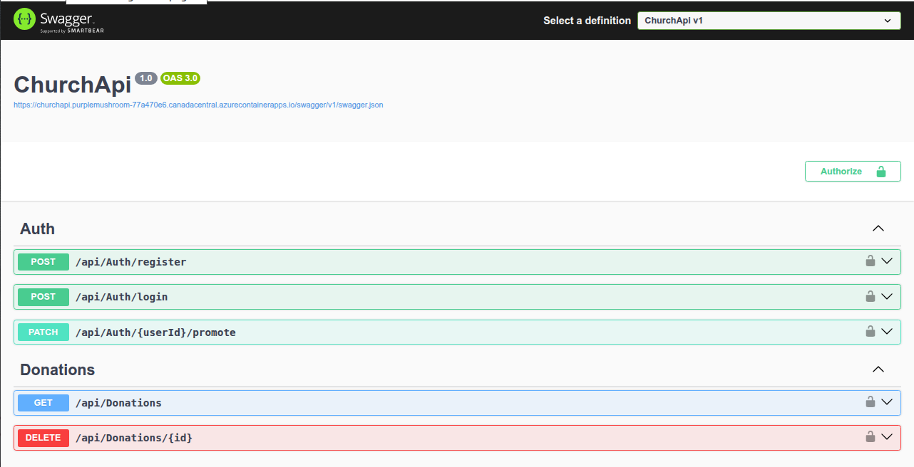
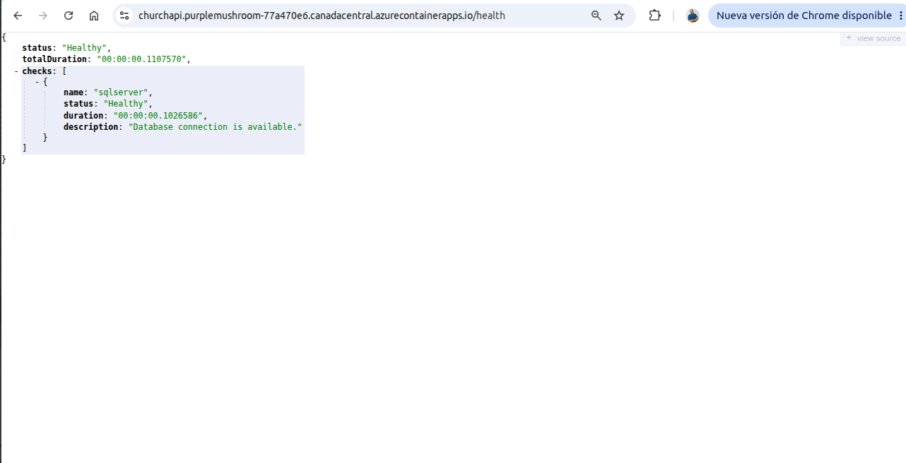

# Church API

[](https://github.com/DervisGomez/appi-miembros/actions/workflows/dotnet.yml)

API REST desarrollada con **ASP.NET Core 8** para la gestión de miembros de una iglesia y sus donaciones. El proyecto demuestra prácticas de backend orientadas a producción: autenticación JWT, autorización por roles, logging estructurado, manejo global de errores, contenedorización, pruebas automatizadas y despliegue en Azure.

> Proyecto de portafolio y aprendizaje. No está pensado para producción sin endurecimiento adicional.

## 🚀 Acceso rápido

| Recurso | Enlace |
|---|---|
| 📖 Swagger UI | [Abrir documentación interactiva](https://churchapi.purplemushroom-77a470e6.canadacentral.azurecontainerapps.io/swagger) |
| 💚 Health Check | [Ver estado de la API](https://churchapi.purplemushroom-77a470e6.canadacentral.azurecontainerapps.io/health) |

## 🌐 Demo

La API está desplegada y disponible públicamente en Azure Container Apps:

| Recurso | URL |
|---|---|
| Swagger UI | https://churchapi.purplemushroom-77a470e6.canadacentral.azurecontainerapps.io/swagger |
| Health Check | https://churchapi.purplemushroom-77a470e6.canadacentral.azurecontainerapps.io/health |

## ☁️ Despliegue en Azure

La aplicación está desplegada en producción utilizando:

- **Azure Container Apps** — hosting serverless de contenedores con ingress HTTPS
- **Azure Container Registry** — almacenamiento y distribución de imágenes Docker
- **Azure SQL Database** — base de datos relacional gestionada
- **Docker** — empaquetado multi-stage de la aplicación
- **Entity Framework Core Migrations** — versionado y aplicación del esquema de base de datos

```text
Código fuente → Docker → Azure Container Registry → Azure Container Apps → Azure SQL Database
```

## 📸 Capturas de pantalla

### Swagger UI



Documentación OpenAPI interactiva con autenticación JWT.

### Health Check



Endpoint de monitoreo que valida el estado de la API y la conectividad con Azure SQL Database.

---

## Características

- Registro, login y promoción de usuarios con roles (`Admin`, `User`)
- CRUD de miembros con paginación y ordenamiento
- Gestión de donaciones asociadas a miembros con filtros y paginación
- Autenticación JWT con HMAC-SHA256
- Autorización basada en roles
- Hash de contraseñas con `PasswordHasher` de ASP.NET Core Identity
- Validación de entrada con Data Annotations
- Manejo global de excepciones con `ProblemDetails` (RFC 7807)
- Logging estructurado con Serilog
- Health checks de conectividad a base de datos
- Swagger / OpenAPI
- Docker y Docker Compose
- Pipeline CI con GitHub Actions
- 46 pruebas unitarias e de integración

## Tecnologías

- ASP.NET Core 8
- Entity Framework Core 8
- SQL Server
- SQLite (tests de integración)
- Docker
- Azure Container Apps
- Azure SQL Database
- Azure Container Registry
- JWT Authentication
- Serilog
- Health Checks
- Swagger (Swashbuckle)
- xUnit, Moq, FluentAssertions
- GitHub Actions

## Arquitectura

El proyecto sigue una **arquitectura en capas dentro de un único proyecto API**, sin sobreingeniería:

```text
HTTP Request
     │
     ▼
Controllers        ← Contratos HTTP, autorización, validación de modelo
     │
     ▼
Services           ← Lógica de negocio, reglas, orquestación
     │
     ▼
AppDbContext       ← Persistencia con EF Core
     │
     ▼
SQL Server
```

**Patrones aplicados:**

| Patrón | Implementación |
|---|---|
| DTO | Desacopla contrato HTTP de entidades de dominio |
| Service Layer | Encapsula lógica de negocio |
| Manual Mappers | Traducción explícita entidad ↔ DTO |
| Options Pattern | `JwtOptions` para configuración tipada |
| Extension Methods | `Program.cs` mínimo, configuración modular |
| Middleware | `ExceptionMiddleware` para errores consistentes |
| Dependency Injection | Servicios registrados como `Scoped` |

## Estructura del proyecto

```text
.
├── ChurchApi.sln
├── Dockerfile
├── docker-compose.yml
├── .editorconfig
├── .github/workflows/dotnet.yml
├── src/ChurchApi/
│   ├── Controllers/       Endpoints HTTP (Auth, Members, Donations)
│   ├── Data/              DbContext y configuración EF Core
│   ├── Dtos/              Modelos de request, response y query
│   ├── Enums/             UserRole, SortOrder
│   ├── Exceptions/        Excepciones de dominio (NotFound, Conflict, etc.)
│   ├── Extensions/        Registro de servicios y pipeline HTTP
│   ├── HealthChecks/      Verificación de conectividad SQL Server
│   ├── Helpers/           Password hashing, paginación
│   ├── Interfaces/        Contratos de servicios (IJwtTokenService)
│   ├── Mappers/           Mapeo manual entidad → DTO
│   ├── Middleware/        Manejo global de excepciones
│   ├── Migrations/        Migraciones EF Core
│   ├── Models/            Entidades de dominio
│   ├── Options/           Clases de configuración tipada
│   ├── Services/          Lógica de negocio e interfaces
│   └── Program.cs         Punto de entrada
└── tests/ChurchApi.Tests/
    ├── Fixtures/          Fixtures reutilizables
    ├── Helpers/           Factory de DbContext para unit tests
    ├── Integration/       Tests HTTP end-to-end
    └── Unit/              Tests de capa de servicios
```

## Requisitos

- [.NET 8 SDK](https://dotnet.microsoft.com/download/dotnet/8.0)
- SQL Server (local o Docker)
- [Docker](https://www.docker.com/) y Docker Compose (opcional)
- [Azure CLI](https://learn.microsoft.com/cli/azure/install-azure-cli) (opcional, para despliegue en Azure)

## Configuración

### Variables de entorno

ASP.NET Core mapea dobles guiones bajos (`__`) a secciones anidadas de configuración.

| Variable | Descripción | Requerida |
|---|---|---|
| `ConnectionStrings__SqlServer` | Cadena de conexión SQL Server | Sí |
| `Jwt__Secret` | Clave de firma JWT (mín. 32 caracteres) | Sí |
| `Jwt__Issuer` | Emisor del token | Sí |
| `Jwt__Audience` | Audiencia del token | Sí |
| `Jwt__ExpirationMinutes` | Duración del token en minutos | Sí |
| `Database__ApplyMigrations` | Aplicar migraciones al iniciar (`true`/`false`) | No |
| `ASPNETCORE_ENVIRONMENT` | Entorno de ejecución | No |
| `ASPNETCORE_URLS` | URLs de escucha del servidor | No |

### Desarrollo local con user-secrets

```bash
dotnet user-secrets set "ConnectionStrings:SqlServer" \
  "Server=localhost,1433;Database=ChurchDB;User Id=sa;Password=YourPassword;TrustServerCertificate=True;" \
  --project src/ChurchApi

dotnet user-secrets set "Jwt:Secret" \
  "ReplaceWithALongLocalDevelopmentSecretAtLeast32Chars" \
  --project src/ChurchApi
```

`appsettings.json` no contiene secretos reales por diseño.

## Ejecución local

```bash
git clone git@github.com:DervisGomez/appi-miembros.git
cd appi-miembros
dotnet restore
dotnet build
dotnet ef database update --project src/ChurchApi
dotnet run --project src/ChurchApi
```

| Perfil | URL |
|---|---|
| HTTP | http://localhost:5101 |
| HTTPS | https://localhost:7231 |
| Swagger | http://localhost:5101/swagger |

## Docker

### Construir y ejecutar

```bash
docker compose up --build
```

| Servicio | Puerto | Descripción |
|---|---|---|
| `churchapi` | 8080 | API ASP.NET Core |
| `sqlserver` | — (red interna) | SQL Server 2022 |

Swagger en Docker: http://localhost:8080/swagger

### Comandos útiles

```bash
docker compose ps
docker compose logs churchapi
docker compose down
docker compose down -v    # elimina también el volumen de datos
```

El contenedor de la API aplica migraciones automáticamente con `Database__ApplyMigrations=true`.

## Entity Framework

### Crear una migración

```bash
dotnet ef migrations add NombreMigracion --project src/ChurchApi
```

### Aplicar migraciones

```bash
dotnet ef database update --project src/ChurchApi
```

### Modelo de datos

- **Users**: credenciales y roles
- **Members**: datos personales con email único
- **Donations**: montos asociados a miembros con restricción FK

Índices en campos de búsqueda frecuente (email, fecha, monto). `DeleteBehavior.Restrict` en donaciones para evitar borrados en cascada.

## ☁️ Azure — Guía de despliegue

El proyecto está desplegado en Azure y también puede replicarse siguiendo este flujo:

```text
Código fuente
     │
     ▼
Dockerfile (multi-stage build)
     │
     ▼
Azure Container Registry (ACR)
     │
     ▼
Azure Container Apps
     │
     ▼
Azure SQL Database
```

### Pasos de despliegue

**1. Crear Azure SQL Database**

```bash
az sql server create --name churchapi-sql --resource-group churchapi-rg \
  --location eastus --admin-user sqladmin --admin-password '<password>'

az sql db create --resource-group churchapi-rg --server churchapi-sql \
  --name ChurchDB --service-objective S0
```

**2. Construir y subir imagen a ACR**

```bash
az acr create --resource-group churchapi-rg --name churchapiregistry --sku Basic

az acr build --registry churchapiregistry \
  --image churchapi:latest .
```

**3. Crear Container App**

```bash
az containerapp create \
  --name churchapi \
  --resource-group churchapi-rg \
  --environment churchapi-env \
  --image churchapiregistry.azurecr.io/churchapi:latest \
  --target-port 8080 \
  --ingress external \
  --env-vars \
    ConnectionStrings__SqlServer="Server=tcp:churchapi-sql.database.windows.net,1433;Database=ChurchDB;..." \
    Jwt__Secret="secret-from-key-vault" \
    Jwt__Issuer="ChurchApi" \
    Jwt__Audience="ChurchApi.Clients" \
    Jwt__ExpirationMinutes="60" \
    Database__ApplyMigrations="true" \
    ASPNETCORE_ENVIRONMENT="Production"
```

**4. Configurar secretos**

En producción, almacenar `Jwt__Secret` y la cadena de conexión en **Azure Key Vault** o como secretos de Container Apps, nunca en el repositorio.

### Consideraciones Azure

| Aspecto | Configuración |
|---|---|
| Puerto | `8080` (configurado en Dockerfile y `ASPNETCORE_URLS`) |
| Health probe | `GET /health` — compatible con liveness/readiness de Container Apps |
| Base de datos | `ConnectionStrings__SqlServer` apunta a Azure SQL |
| Migraciones | `Database__ApplyMigrations=true` en primer despliegue; luego migrar con pipeline CI/CD |
| HTTPS | Gestionado por Container Apps ingress |

## Endpoints principales

### Auth

| Método | Endpoint | Auth | Descripción |
|---|---|---|---|
| `POST` | `/api/auth/register` | — | Registrar usuario |
| `POST` | `/api/auth/login` | — | Obtener JWT |
| `PATCH` | `/api/auth/{userId}/promote` | Admin | Promover a Admin |

### Members

| Método | Endpoint | Auth | Descripción |
|---|---|---|---|
| `GET` | `/api/members` | Usuario | Listar (paginado) |
| `GET` | `/api/members/{id}` | Usuario | Obtener por ID |
| `POST` | `/api/members` | Usuario | Crear miembro |
| `PUT` | `/api/members/{id}` | Admin | Actualizar miembro |
| `DELETE` | `/api/members/{id}` | Admin | Eliminar miembro |
| `GET` | `/api/members/{memberId}/donations` | Usuario | Donaciones del miembro |
| `POST` | `/api/members/{memberId}/donations` | Usuario | Crear donación |

### Donations

| Método | Endpoint | Auth | Descripción |
|---|---|---|---|
| `GET` | `/api/donations` | Usuario | Listar (paginado, filtros) |
| `DELETE` | `/api/donations/{id}` | Admin | Eliminar donación |

## Health Check

```text
GET /health
```

| Entorno | URL |
|---|---|
| **Azure (producción)** | https://churchapi.purplemushroom-77a470e6.canadacentral.azurecontainerapps.io/health |
| Local | http://localhost:5101/health |
| Docker | http://localhost:8080/health |

Respuesta JSON con estado general, duración y detalle por check:

```json
{
  "status": "Healthy",
  "totalDuration": "00:00:00.0123456",
  "checks": [
    {
      "name": "sqlserver",
      "status": "Healthy",
      "duration": "00:00:00.0100000",
      "description": "Database connection is available."
    }
  ]
}
```

- `200 OK` → sistema saludable
- `503 Service Unavailable` → degradado o no saludable

## Swagger

Disponible al ejecutar la aplicación:

| Entorno | URL |
|---|---|
| **Azure (producción)** | https://churchapi.purplemushroom-77a470e6.canadacentral.azurecontainerapps.io/swagger |
| Local | http://localhost:5101/swagger |
| Docker | http://localhost:8080/swagger |

Incluye esquema de seguridad Bearer para probar endpoints autenticados.

## Seguridad

- **JWT** con validación de issuer, audience, lifetime y firma HMAC-SHA256
- `ClockSkew = Zero` para evitar tokens expirados con margen
- `RequireHttpsMetadata` habilitado fuera de Development
- Contraseñas hasheadas con `PasswordHasher` (nunca en texto plano)
- Roles `Admin` y `User` con `[Authorize(Roles = "Admin")]`
- Secretos externos al repositorio (user-secrets / variables de entorno / Key Vault)

## Logging

**Serilog** configurado en `appsettings.json`:

- Sink de consola con plantilla estructurada
- Request logging con tiempo de respuesta por petición
- Endpoints `/health` logueados en nivel `Debug`
- Enriquecimiento con nombre de aplicación y entorno
- Errores capturados en `ExceptionMiddleware` y request logging

## Testing

```bash
dotnet test
```

| Suite | Tests | Alcance |
|---|---|---|
| Unit — AuthService | 6 | Registro, login, conflictos |
| Unit — MemberService | 7 | CRUD, paginación, constraints |
| Unit — DonationService | 19 | Filtros, paginación, validación |
| Integration — Auth | 4 | Endpoints HTTP, ProblemDetails |
| Integration — Members | 6 | CRUD, autorización |
| Integration — Donations | 3 | Listado, creación, eliminación |
| Integration — Health | 1 | Endpoint `/health` |
| **Total** | **46** | |

## Próximas mejoras

- Refresh tokens
- Rate limiting en endpoints de autenticación
- Versionado de API (`/api/v1/...`)
- OpenTelemetry y métricas
- Reporte de cobertura en CI
- Pipeline CD hacia Azure Container Apps
- FluentValidation para reglas de negocio complejas

## 📸 Más capturas (opcional)

Capturas adicionales que puedes agregar al portafolio:

| Imagen | Descripción | Ruta sugerida |
|---|---|---|
| Arquitectura Azure | Diagrama del despliegue | `docs/images/azure-architecture.png` |
| GitHub Actions | Pipeline CI en verde | `docs/images/ci-pipeline.png` |
| Docker Compose | Servicios corriendo | `docs/images/docker-compose.png` |

```markdown
<!-- Ejemplo para insertar en portafolio -->


```

## Licencia

MIT
